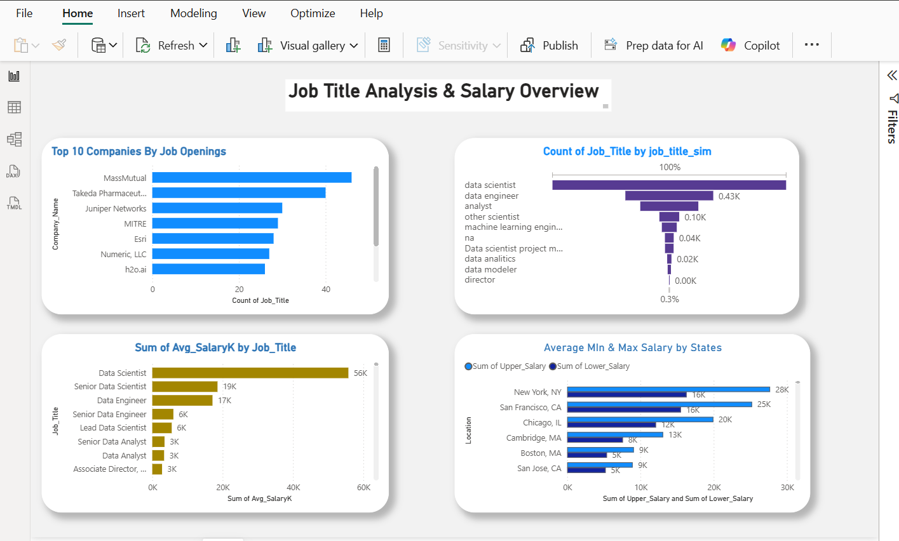
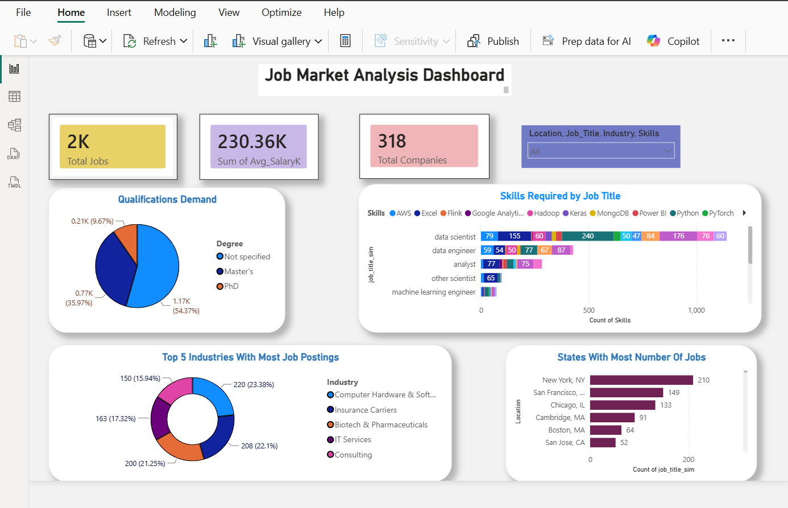

# 📊 Job Market Analysis — PRDA 04

## 🔍 Project Overview
End-to-end data analytics project analyzing **742 
real-world data science job postings** to uncover 
hiring trends, salary benchmarks, skill demands, 
and industry patterns.

---

## 🛠️ Tools Used
| Tool | Purpose |
|------|---------|
| Python (pandas, numpy) | Data Cleaning |
| Jupyter Notebook | Code & Documentation |
| Power BI | Dashboard & Visualization |

---

## 📁 Dataset
- **Source:** Glassdoor Job Postings
- **Records:** 742 job postings
- **Features:** 42 columns
- **Domain:** Data Science roles across USA

---

## 📊 Dashboard Preview

---

## 🔑 Key Findings
- 📍 New York leads with 55 job postings
- 👨‍💻 Data Scientist is #1 role — 42% of postings
- 🐍 Python & SQL are most in-demand skills
- 🏭 Biotech & Pharma is top hiring industry
- 💰 San Francisco offers highest salary bands
- 🏢 MassMutual leads in job openings

---

## 🎯 What I Explored
During my analysis I explored multiple 
dimensions of the job market:

**Geography** — Which cities and states 
are the hottest markets for data roles?

**Compensation** — What salary ranges 
should I expect and where?

**Industries** — Which sectors are 
investing most in data science talent?

**Companies** — Who are the biggest 
hirers and what do they offer?

**Skills** — What technical skills give 
the best chance of getting hired?

**Job Titles** — Which roles have the 
most demand and best pay?

**Education** — Does a higher degree 
actually lead to better pay?

**Hidden Patterns** — What other 
interesting correlations exist in the 
data that are not obvious at first glance?

---

## 🧹 Data Cleaning Steps
1. ✅ Checked duplicates — 0 found
2. ✅ Removed \n from Company Name
3. ✅ Replaced negative values with NaN
4. ✅ Handled 104 missing values in Skills
5. ✅ Combined 16 skill columns into one
6. ✅ Dropped irrelevant columns
7. ✅ Exported cleaned CSV

---

## 📂 Files in this Repository
| File | Description |
|------|-------------|
| cleaned_job_market.csv | Cleaned dataset |
| job_market_project.ipynb | Python notebook |
| JobMarketAnalysis_Report_v3.docx | Full report |
| dashboard1.png | Power BI Page 1 |
| dashboard2.png | Power BI Page 2 |

---

## 📬 Connect With Me
- 💼 LinkedIn: [your LinkedIn URL here]
